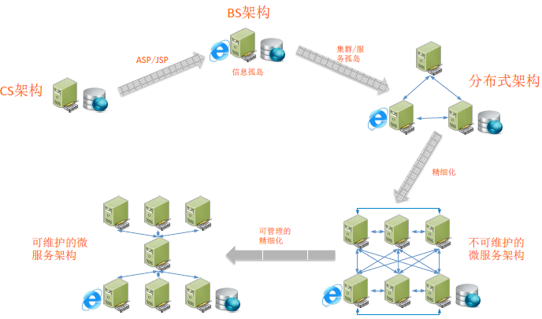
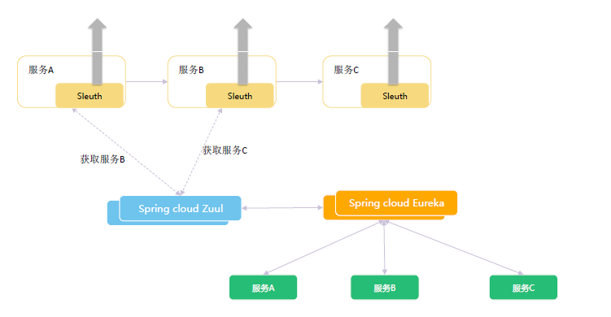
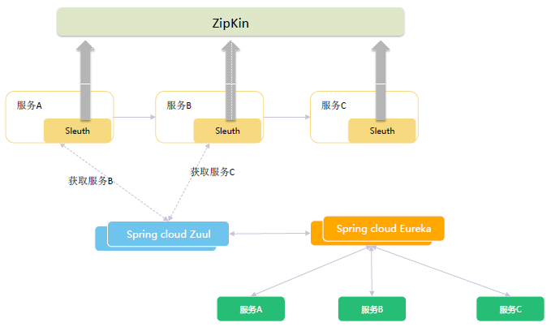
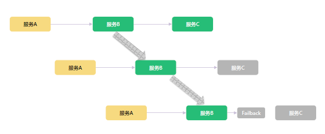
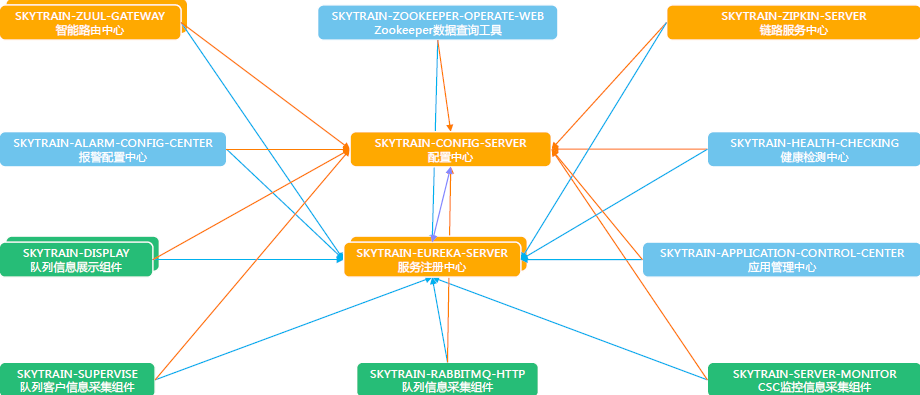

## SpringCloud微服务架构升级总结


## 目录
- 应用系统的架构历史
- 什么是微服务？
- 微服务架构的优势
- 什么是Spring Boot？什么是Spring Cloud？
- 微服务，Spring Boot，Spring Cloud三者之间的关系
- Everything is jar, Everything is http
- Spring boot Task 任务启动和定时任务
- Spring boot Actuator 监控
- Spring cloud Config 配置中心
- Spring cloud Eureka 服务注册中心
- Spring cloud Zuul 服务端智能路由
- Spring cloud Ribbon 客户端智能路由
- Spring cloud Sleuth 分布式追踪
- Spring cloud Zipkin 调用链
- Spring cloud Feign http客户端
- Spring cloud Hystrix 断路器
- 我们开发的几个微服务组件—应用管理中心
- 我们开发的几个微服务组件—zookeeper数据查询中心
- 我们开发的几个微服务组件—微服务健康检测中心
- 我们开发的几个微服务组件—定时任务查询中心
- 微服务的分类
- 整体微服务架构图


应用系统的架构历史





## 什么是微服务？
起源:微服务的概念源于 2014 年 3 月 Martin Fowler 所写的一篇文章“Microservices”。文中内容提到：微服务架构是一种架构模式，它提倡将单一应用程序划分成一组小的服务，服务之

间互相协调、互相配合，为用户提供最终价值。


  通信方式:每个服务运行在其独立的进程中，服务与服务间采用轻量级的通信机制互相沟通（通常是基于 HTTP 的 RESTful API）。


  微服务的常规定义:微服务是一种架构风格，一个大型复杂软件应用由一个或多个微服务组成。系统中的各个微服务可被独立部署，各个微服务之间是松耦合的。每个微服务仅关注于完成一件任务。

  

  把原来的一个完整的进程服务，拆分成两个或两个以上的进程服务，且互相之间存在调用关系，与原先单一的进程服务相比，就是“微服务”。（微服务是一个比较级的概念，而不是单一的概念）


## 微服务架构的优势
   可扩展性:在增加业务功能时，单一应用架构需要在原先架构的代码基础上做比较大的调整，而微服务架构只需要增加新的微服务节点，并调整与之有关联的微服务节点即可。在增加业务响应能力时，

单一架构需要进行整体扩容，而微服务架构仅需要扩容响应能力不足的微服务节点。


  容错性:在系统发生故障时，单一应用架构需要进行整个系统的修复，涉及到代码的变更和应用的启停，而微服务架构仅仅需要针对有问题的服务进行代码的变更和服务的启停。其他服务可通过重试、

熔断等机制实现应用层面的容错。


  技术选型灵活:微服务架构下，每个微服务节点可以根据完成需求功能的不同，自由选择最适合的技术栈，即使对单一的微服务节点进行重构，成本也非常低。


  开发运维效率更高:每个微服务节点都是一个单一进程，都专注于单一功能，并通过定义良好的接口清晰表述服务边界。由于体积小、复杂度低，每个微服务可由一个小规模团队或者个人完全掌控，

易于保持高可维护性和开发效率。


  Spring Cloud作为今年最流行的微服务开发框架，不是采用了Spring Cloud框架就实现了微服务架构，具备了微服务架构的优势。正确的理解是使用Spring Cloud框架开发微服务架构的系统，

使系统具备微服务架构的优势（Spring Cloud就像工具，还需要“做”的过程）。


## 什么是Spring Boot？什么是Spring Cloud？
Spring Boot框架是由Pivotal团队提供的全新框架，其设计目的是用来简化基于Spring应用的初始搭建以及开发过程。SpringBoot框架使用了特定的方式来进行应用系统的配置，从而使开发人

员不再需要耗费大量精力去定义模板化的配置文件。


  Spring Cloud是一个基于Spring Boot实现的云应用开发工具，它为基于JVM的云应用开发中的配置管理、服务注册，服务发现、断路器、智能路由、微代理、控制总线、全局锁、决策竞选、分

布式会话和集群状态管理等操作提供了一种简单的开发方式。


## 微服务，Spring Boot，Spring Cloud三者之间的关系
思想：微服务是一种架构的理念，提出了微服务的设计原则，从理论为具体的技术落地提供了指导思想。


脚手架：Spring Boot是一套快速配置脚手架，可以基于Spring Boot快速开发单个微服务。


多个组件的集合：Spring Cloud是一个基于Spring Boot实现的服务治理工具包；Spring Boot专注于快速、方便集成的单个微服务个体；Spring Cloud关注全局的服务治理框架。


## Everything is jar, Everything is http


Spring Boot通过@SpringBootApplication注解标识为Spring Boot应用程序。所有的应用都通过jar包方式编译，部署和运行。

```
@SpringBootApplication 
public class Application {     
    private static final Logger LOGGER = LoggerFactory.getLogger(Application.class);     
    public static void main(String[] args) {         
        SpringApplication.run(Application.class, args);         
        LOGGER.info(”启动成功！");     
    } 
}
```


每个Spring Boot的应用都可以通过内嵌web容器的方式提供http服务，仅仅需要在pom文件中依赖spring-boot-start-web即可，原则上微服务架构希望每个独立节点都提供http服务。

```
    <dependency>
        <groupId>org.springframework.boot</groupId>
        <artifactId>spring-boot-starter-web</artifactId>
    </dependency>
```


## Spring boot Task 任务启动和定时任务
在Spring Boot需要启动任务时，只要继承CommandLineRunner接口实现其run方法即可。

```
@SpringBootApplication 
public class ClientDataListener implements CommandLineRunner
    public void run(String... strings) throws Exception {     
        clientInfoListenerHandler(); 
    }
}
```


在Spring Boot需要执行定时任务时，只需要在定时任务方法上增加@Scheduled(cron = “0 15 0 * * ?”)注解（支持标准cron表达式），并且在服务启动类上增加@EnableScheduling的注解即可。

```
@SpringBootApplication
@EnableScheduling
public class Application {     
    private static final Logger LOGGER = LoggerFactory.getLogger(Application.class);     
    public static void main(String[] args) {         
        SpringApplication.run(Application.class, args);         
        LOGGER.info(”启动成功！");     
    } 
}
```


```
// some class
@Scheduled(cron = "0 15 0 * * ?")
public void someTimeTask() {
    ***
}
```


## Spring boot Actuator 监控
Actuator是spring boot提供的对应用系统自身进行监控的组件，在引入spring-boot-start-web基础上引入spring-boot-starter-actuator即可。

```
    <dependency>
        <groupId>org.springframework.boot</groupId>
        <artifactId>spring-boot-starter-actuator</artifactId>
    </dependency>
```


## Spring cloud Config 配置中心
在我们实现微服务架构时，每个微服务节点都需要自身的相关配置数据项，当节点众多，维护就变得非常困难，因此需要建立一个中心配置服务。

Spring Cloud Config分为两部分。Spring Cloud Config server作为一个服务进程，Spring Cloud Config File为配置文件存放位置。


## Spring cloud Eureka 服务注册中心
  服务注册的概念早在微服务架构之前就出现了，微服务架构更是把原先的单一应用节点拆分成非常多的微服务节点。互相之间的调用关系会非常复杂，Spring Cloud Eureka作为注册中心，

所有的微服务都可以将自身注册到Spring Cloud Eureka进行统一的管理和访问（Eureka和Zookeeper不同，在AOP原则中选择了OP，更强调服务的有效性）


## Spring cloud Zuul 服务端智能路由
  当我们把所有的服务都注册到Eureka（服务注册中心）以后，就涉及到如何调用的问题。Spring Cloud Zuul是Spring Cloud提供的服务端代理组件，

可以看做是网关，Zuul通过Eureka获取到可用的服务，通过映射配置，客户端通过访问Zuul来访问实际需要需要访问的服务。所有的服务通过spring.application.name做标识，

不同IP地址，相同spring.application.name就是一个服务集群。当我们增加一个相同spring.application.name的节点，Zuul通过和Eureka通信获取新增节点的信息实现智能路由，

增加该类型服务的响应能力。


## Spring cloud Ribbon 客户端智能路由
  与Spring Cloud Zuul的服务端代理相对应，Spring Cloud Ribbon提供了客户端代理。在服务端代理中，客户端并不需要知道最终是哪个微服务节点为之提供服务，

而客户端代理获取实质提供服务的节点，并选择一个进行服务调用。Ribbon和Zuul相似，也是通过和Eureka（服务注册中心）进行通信来实现客户端智能路由。


## Spring cloud Sleuth 分布式追踪





## Spring cloud Zipkin 调用链
  


## Spring cloud Feign http客户端
Spring Cloud Feign是一种声明式、模板化的http客户端。 使用Spring Cloud Feign请求远程服务时能够像调用本地方法一样，让开发者感觉不到这是远程方法（Feign集成了Ribbon做负载均衡）。


把远程服务和本地服务做映射

```
@FeignClient(name = "rabbitmq-http", url = "${SKYTRAIN_RABBITMQ_HTTP}") 
public interface TaskService {     
    @RequestMapping(value = "/api/queues", method = RequestMethod.GET)     
    public String query(@RequestHeader("Authorization") String token); 
}
```


以调用本地服务的方式调用远程服务

```
@Autowired 
private TaskService taskService; 
private String queryRabbitmqStringInfo() {     
    byte[] credentials = Base64 .encodeBase64((rabbitmqHttpUserName + ":" + rabbitmqHttpPassword).getBytes(StandardCharsets.UTF_8));     
    String token = "Basic " + new String(credentials, StandardCharsets.UTF_8);     
    return taskService.query(token); 
}
```


## Spring cloud Hystrix 断路器##  

## 

## 我们开发的几个微服务组件—应用管理中心
应用管理中心可以对每个已经注册的微服务节点进行停止，编译，打包，部署，启动的完整的上线操作。


## 我们开发的几个微服务组件—zookeeper数据查询中心
zookeeper数据查询中心根据zookeeper地址，端口，命令获取zookeeper数据信息。


## 我们开发的几个微服务组件—微服务健康检测中心
健康检测中心周期性检查每个微服务的状态，当发现有微服务状态处于DOWN或连接超时时，触发报警


## 我们开发的几个微服务组件—定时任务查询中心
```
// 在BeanPostProcessor子类中拦截***
@Component
public class SkytrainBeanPostProcessor implements BeanPostProcessor, Ordered {
    /**
     * Bean 实例化之后进行的处理
     */
    public Object postProcessAfterInitialization(Object bean, String beanName) throws BeansException {
        beanPostProcessor.postProcessAfter(bean, beanName);
        return bean;
    }
}
// 拦截后获取定时任务注解***
public Object postProcessAfter(Object bean, String beanName) {
    Class targetClass = AopUtils.getTargetClass(bean);
    Map annotatedMethods = MethodIntrospector.selectMethods(targetClass,
            new MethodIntrospector.MetadataLookup() {
 
                public Set inspect(Method method) {
 
                    Set scheduledMethods = AnnotatedElementUtils.getMergedRepeatableAnnotations(method,
                            Scheduled.class, Schedules.class);
                    return (!scheduledMethods.isEmpty() ? scheduledMethods : null);
                }
            });
    if (!annotatedMethods.isEmpty()) {
        String className = targetClass.getName();
        for (Map.Entry entry : annotatedMethods.entrySet()) {
            Method method = entry.getKey();
            for (Scheduled scheduled : entry.getValue()) {
                String key = className + ":" + method.getName();
                String value = scheduled.toString();
                taskInfos.put(key, value);
            }
        }
    }
    return null;
}
 
// 获取定时任务后注册***
public void taskRegister() {
    String nodeInfo = ipAddress + ":" + serverPort + ":";
    try {
        /**
         * 定时任务
         */
        Map infos = taskInfos;
        for (Entry item : infos.entrySet()) {
            String taskId = nodeInfo + item.getKey();
            String taskParameter = item.getValue();
            JSONObject info = new JSONObject();
            info.put("taskId", taskId);
            info.put("taskParameter", taskParameter);
            info.put("applicationName", applicationName);
            info.put("taskType", "schedule");
            LOGGER.info(info.toString());
            zooKeeperExecutor.createZKNode(SKYTRAIN_TASK_ZKNODE_PREFIX + taskId, info.toString());
        }
    }
    catch (Exception ex) {
        LOGGER.error("", ex);
    }
}
```


## 微服务的分类
* 微服务平台组件

* 公共服务组件

* 基础服务组件/业务服务组件


## 整体微服务架构图 




# 参考
1. [SpringCloud微服务架构升级总结](http://college.creditease.cn/detail/146)


 