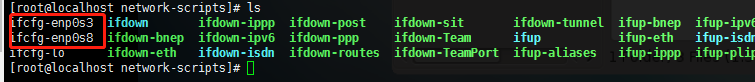

# VirtualBox配置CentOS虚拟机
用虚拟机装Linux系统时，经常会出现一些问题。比如：从主机到虚拟机之间网络不通；虚拟机中无法联网；虚拟机中的IP地址不固定。以下方法解决这些问题。
#### 目标
配置一台拥有固定IP、可以联网的Centos7.2 虚拟机

## 一. 创建CentOS的网卡 

### 环境
系统：CentOS7.2 <br>
虚拟机软件：Virtualbox

### 步骤
#### 1. 创建Nat Network 虚拟网卡
**文件(File) -> 偏好设定(Preferences)-> 网络(Network)** 如下图<br>
<div align="center"></div>

>**提示：<br>
>1.这里采用网络地址转换（NAT）模式，是为虚拟机配置一个上网的网卡。<br>
>2.修改IP地址,视自己实际情况而定！**

#### 2. 创建仅主机虚拟网卡 
*文件(File) -> 仅主机网络管理((Host Network Manager)** (或者使用快捷键 `Ctrl + W`)，添加一个 仅主机模式的网卡，设置如下图 <br>
<div align="center"></div>

>**提示：<br>
>1.对虚拟机网络设置，需要先关闭虚拟机;<br>
>2.这里采用Host-Only模式是为了给虚拟机设置一个固定IP，让主机与虚拟机网络相通。<br>
>3.默认创建的网络为 192.168.56.1/24 , 子网掩码为 255.255.255.0**

## 二. 使用nat和仅主机网络
安装centos7的时候注意选择两个网卡,配置CentOS7虚拟机里面能上外网(NAT网络)，而主机与CentOS7虚拟机也能连通(仅主机模式)
### 1. 配置NAT网络
对CentOS7虚拟机网络设置，添加网卡1和网卡2，分别选择连接方式和对应的网卡：
两个网卡分别为：
```
nat(虚拟机访问互联网，使用 10.0.2.x 网段)
host-only(虚拟机和主机互相通信，使用 192.168.56.x 网段)
在偏好设置里面设置网络。如下图配置：
```
<div align="center"></div>
<div align="center"></div>

>注意需要记下两个网卡的mac地址，后面需要在网络配置中使用到

### 2. 配置主机网卡
开机,进入 `/etc/sysconfig/network-scripts/` 目录，可以看到 `ifcfg-enp0s3` 和 `ifcfg-enp0s8` 配置文件（如果安装centos7没有选择两个网卡的话，应该只有ifcfg-enp0s3 一个配置文件,如果只有一个配置文件，则另外一个就用这个copy过来改，需要更改UUID的值），如下图：
<div align="center"></div>

(1) 配置 host-only 网卡<br>
编辑 ifcfg-enp0s8 文件  `vim ifcfg-enp0s8` ，配置如下

```
TYPE=Ethernet
PROXY_METHOD=none
BROWSER_ONLY=no
BOOTPROTO=static
DEFROUTE=yes
IPV4_FAILURE_FATAL=no
IPV6INIT=yes
IPV6_AUTOCONF=yes
IPV6_DEFROUTE=yes
IPV6_FAILURE_FATAL=no
IPV6_ADDR_GEN_MODE=stable-privacy
NAME=enp0s8
UUID=eb9a9bdb-0621-4162-ba36-a4d1d80cb53c
DEVICE=enp0s8
ONBOOT=yes
IPADDR=192.168.56.101
PREFIX=24
NETMASK=255.255.255.0
HWADDR=08:00:27:E3:C6:22
GATEWAY=192.168.56.1
DNS1=202.116.32.254
DNS1=202.116.32.134
```
<div align="center"></div>

>**HWADDR**与仅主机网络设置中的一致

保存，退出，重启网络 `service network restart` 此时宿主机和虚拟机可以相互ping通

(2) 配置 Nat Network 网卡<br>
编辑 ifcfg-enp0s3 文件  `vim ifcfg-enp0s3` ，配置如下

```
TYPE=Ethernet
PROXY_METHOD=none
BROWSER_ONLY=no
BOOTPROTO=dhcp
DEFROUTE=yes
IPV4_FAILURE_FATAL=no
IPV6INIT=yes
IPV6_AUTOCONF=yes
IPV6_DEFROUTE=yes
IPV6_FAILURE_FATAL=no
IPV6_ADDR_GEN_MODE=stable-privacy
NAME=enp0s3
UUID=eb9a9bdb-0621-4162-ba36-a4d1d80cb53f
DEVICE=enp0s3
ONBOOT=yes
HWADDR=08:00:27:24:D7:08
```
<div align="center"></div>

>1.将ONBOOT=no 改为 yes (最开始默认为NO，yes意思是，"BOOT开机"时就能使用这张网卡),再添加BOOTPROTO为dhcp（只有“静态static”和“动态dhcp”两种方式）<br>
>2.**HWADDR**与仅NAT网络设置中的一致<br>
>3.**DEVICE**,**NAME** 改为对应的网卡配置名

保存，退出，重启网络 `service network restart` 。此时可以ping通baidu,即虚拟机可以访问外网。`ip addr`可以看到两个网卡的配置

# 参考
1. Virtualbox的centos7 nat和桥接网络配置 . [https://www.centos.bz/2017/08/virtualbox-centos7-nat-bridge/](https://www.centos.bz/2017/08/virtualbox-centos7-nat-bridge/)
2. VirtualBox中CentOS7.2 网络配置（固定IP+联网）. [https://www.linuxidc.com/Linux/2018-04/151924.htm](https://www.linuxidc.com/Linux/2018-04/151924.htm)