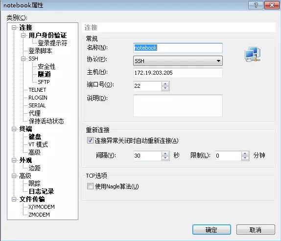
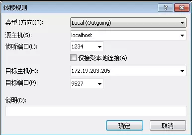

**Jupyter Notebook的远程连接配置**
>以下操作前请先导入 anaconda 环境变量
>```
>export PATH="/opt/anaconda3/bin:$PATH"
>```

+ **快速配置用于快速启动 jupyter notebook ，基本配置用于讲解配置基本过程。**  
+ **快速配置(贴完代码)即可远程使用  jupyter notebook 服务。无需进行基本配置。**
+ **进入页面后根目录为自己的 home 目录。**  

# 快速配置
在自己的命令行中执行下面的脚本，为自己生成 jupyter notebook 远程访问服务。
```
jupyter notebook --generate-config
#消除配置文件的注释
sed -i 's/^#\([ ]*c.NotebookApp.ip\)/\1/' ~/.jupyter/jupyter_notebook_config.py
sed -i 's/^#\([ ]*c.NotebookApp.port\)/\1/' ~/.jupyter/jupyter_notebook_config.py
sed -i 's/^#\([ ]*c.NotebookApp.open_browser\)/\1/' ~/.jupyter/jupyter_notebook_config.py
sed -i 's/^#\([ ]*c.NotebookApp.password\)/\1/' ~/.jupyter/jupyter_notebook_config.py

#修改启动参数配置
sed -i 's/^[ ]*c.NotebookApp.ip.*/c.NotebookApp.ip = "*"/g' ~/.jupyter/jupyter_notebook_config.py
sed -i 's/^[ ]*c.NotebookApp.port.*/c.NotebookApp.port = 6666/g' ~/.jupyter/jupyter_notebook_config.py
sed -i 's/^[ ]*c.NotebookApp.open_browser.*/c.NotebookApp.open_browser = False/g' ~/.jupyter/jupyter_notebook_config.py
sed -i 's/^[ ]*c.NotebookApp.password.*/c.NotebookApp.password = "sha1:2f319121e25b:f20f8fe27e89d0afcc70b7cf3d6e997268abd2f5"/g' ~/.jupyter/jupyter_notebook_config.py

nohup jupyter notebook >/dev/null 2>&1 &
```

完成后，访问端口为 6666 ，密码为 123456。
>每个人的 jupyter notebook 端口可以修改，将上面代码中的6666修改为自己的端口即可。请使用自己的 vnc端口号+64000 以防止冲突。比如我自己的vnc端口号是11，那就将以上配置改成 64011 :
>  - 25服务器访问 : http://50125.hnbdata.cn:64011/
>  - 26服务器访问 : http://50126.hnbdata.cn:64011/

如需关闭 jupyter notebook ,需杀掉 jupyter notebook 的进程
```
ps -ef| grep jupyter |grep -v grep|cut -c 9-15|xargs kill -9
```

# 基本配置
1. 打开python，输入以下语句：

    ```
    from notebook.auth import passwd
    passwd()
    ```

    按照操作输入密码（这个密码是你以后登录notebook时使用的密码）之后就会得到一串字符，要记住这个字符，后面会用到

2. 生成配置文件
    退出python，输入如下命令：

    ```
    jupyter notebook --generate-config
    ```
    该命令会在用户的主目录下创建一个.jupyter文件夹，并在文件夹下生成jupyter_notebook_config.py文件

3. 修改配置文件
    打开jupyter_notebook_config.py，可以使用如下命令找到该文件
    ```
    find | grep jupyter_notebook_config.py
    vim ~/.jupyter/jupyter_notebook_config.py
    ```

    打开jupyter_notebook_config.py文件，修改里面的：
    
    ```
    #设置可访问的ip为任意
    c.NotebookApp.ip = '*'
    #设置默认不打开浏览器
    c.NotebookApp.open_browser = False
    c.NotebookApp.password = '第1步生成的密文'
    # 设置访问端口
    c.NotebookApp.port = 6666
    # 设置notebook存储目录
    c.NotebookApp.notebook_dir = '/your/file/saved/path/'
    ```

4. 启动Jupyter Notebook
    在命令行输入 jupyter notebook就可以开启服务了。但我们一般希望Jupyter Notebook在后台运行，所以可以输入以下命令

    ```
    nohup jupyter notebook >/dev/null 2>&1 &
    ```

# 其他配置

## 使用隧道
1. 配置隧道

    要想使用本地方式访问Jupyter Notebook，需要和服务器建立起一个隧道，一般在使用的本地的终端工具上建立就可以了。如使用xshell，点击新建：

    

    其中主机名和端口就是你要连接的服务器的ip地址和端口号

    然后，点击左侧的  “隧道” -- “添加”

    

    源主机和侦听端口是本地电脑的ip地址和端口，这个源主机ip一般 localhost 就好了，端口是打开本地notebook的端口，可以从0-65535里在不占用其他端口的情况下随意设置。如果设置的端口号是1234，则未来在本地浏览器上输入   http://localhost:1234  即可进行访问。目标主机和端口分别填写的是服务器内网的IP地址和在服务器上为notebook服务打开的端口号

2. 使用方法

    打开浏览器，在地址栏输入 http://localhost:1234 (你设置的本地端口)，输入第1步时设下的密码。就可以进入notebook了。

## 拓展应用

可以在notebook的基础上添加一些插件，如 jupyter-themes、Jupyter notebook extensions

1. jupyter-themes 

    可以直接使用pip进行安装
    ```
    pip install jupyterthemes
    ```

    安装好后，使用命令jt –t monokai 就可以开启monokai主题了。jt –r可以恢复默认主题， jt -l查看当前有哪些模式可选

    ```
    jt -l   # 查看当前有可选模式
    jt –t monokai   # 开启monokai主题
    jt –r  # 恢复默认主题
    ```

2. Jupyter notebook extensions

    直接pip安装
    ```
    pip install jupyter_contrib_nbextensions
    ```

# 参考
1. Jupyter Notebook 远程连接及配置方法说明 . https://www.jianshu.com/p/08f276d48669